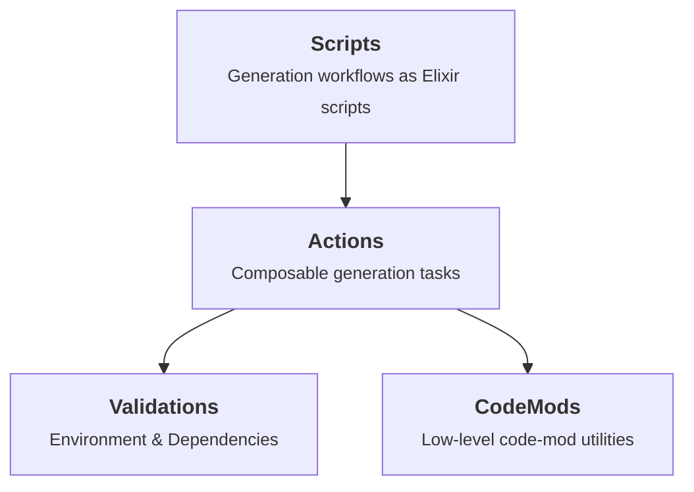
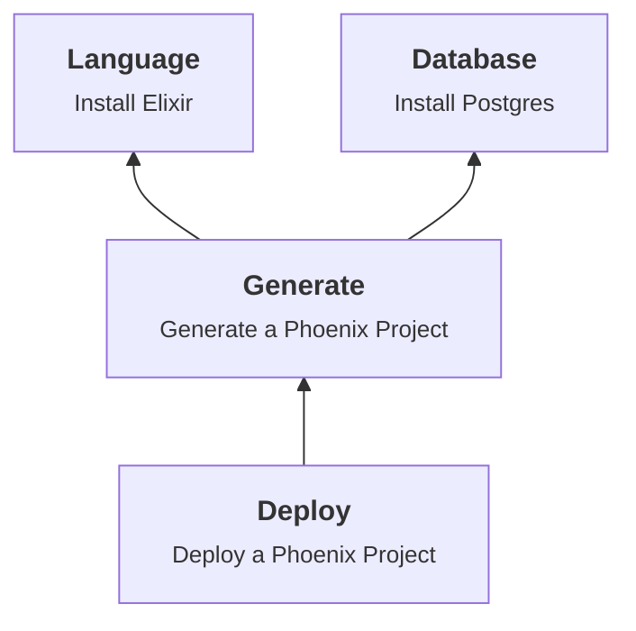

# ProGen

A scriptable Elixir project generator.

ProGen is a coordination layer that combines Elixir code generators,
Igniter/Sourceror code mods, and basic OS commands in a composable / extensible
system.

The goal is full-lifecycle project generation: configuration, CI/CD,
deployment, DevOps, etc.

**Status:** Early-stage development (v0.0.1)

## Architecture

ProGen has a extensible library of Scripts, Actions, Validations and CodeMods.



### Actions

Actions can be composed into a graph tailored for a particular workflow.  For example:



Actions are modules that implement the `Action` behavior

| Callback   | Description                            |
|------------|----------------------------------------|
| depends_on | list of other actions to run prior     |
| validate   | environment and dependency checks      |
| needed?    | idempotency test                       |
| perform    | generation and code-mod logic          |
| confirm    | test to ensure correct performance     |

**Auto-discovery:** Any module named `ProGen.Action.<Name>` is automatically
registered. The name is derived from the segments after `ProGen.Action`,
downcased/underscored and dot-joined (e.g. `ProGen.Action.Test.Echo` becomes
`"test.echo"`). Namespaces are arbitrarily deep. No manual registration needed.
Goal is to make it easy to create custom actions.

**Running actions:**

```elixir
ProGen.Actions.run("test.echo", [message: "hello"])
#=> {"hello\n", 0}
```

**Inspecting actions:**

```elixir
ProGen.Actions.list_actions()
#=> ["echo", "inspect", "test.echo", "phoenix.new"]

ProGen.Actions.action_info("phoenix.new")
#=> {:ok, %{module: ProGen.Action.Phoenix.New, name: "phoenix.new", description: "...", usage: "...", opts_def: [...]}}
```

### Scripts

Scripts are executable files that use `ProGen.Script` functions to define
end-user generation workflows. CLI parsing is handled by
[Optimus](https://github.com/funbox/optimus).

**Full example** (`scripts/greet`):

```elixir
#!/usr/bin/env elixir

# A simple greeting script that demonstrates CLI argument parsing,
# flags, and basic ProGen.Script usage.

Mix.install([{:pro_gen, path: "~/src/pro_gen"}])

alias ProGen.Script, as: PS

# Declare the CLI schema
# These values can be retrieved using PS.cli_args()
PS.cli_args(
  description: "A simple greeting script",
  args: [
    name: [
      value_name: "NAME", 
      help: "Name to greet",
      required: true, 
      parser: :string
    ]
  ],
  flags: [
    loud: [
      short: "-l",
      long: "--loud",
      help: "Greet loudly"
    ]
  ]
) 

# Parse the CLI args, returning an error message for invalid args.
# CLI args can be retrieved using PS.cli_vals()
PS.parse_args() 

# Get the input name using cli_vals
name = PS.cli_vals().name

if PS.cli_vals().loud do 
  PS.puts "HELLO #{String.upcase(name)}" 
else 
  PS.puts "Hello #{name}"
end
```

Run it:

```bash
./scripts/progen_greet --name World
```

**Core script functions:**

| Function     | Description                                   |
|--------------|-----------------------------------------------|
| `cli_args`   | Store an Optimus schema                       |
| `parse_args` | Parse `System.argv()` using the stored schema |
| `puts`       | Print a formatted message                     |
| `log`        | Log an info message via Logger                |
| `command`    | Run an arbitrary system command               |
| `action`     | Run a ProGen action                           |
| `cd`         | Change the working directory                  |

## Extending ProGen

### Actions

Create a module under your project's namespace that starts with `ProGen.Action.`.
It will be auto-discovered at runtime — no manual registration needed.

```elixir
defmodule ProGen.Action.MyCustom do
  use ProGen.Action

  @opts_def [
    name: [type: :string, required: true, doc: "The name"]
  ]

  @impl true
  def perform(args) do
    name = Keyword.fetch!(args, :name)
    {:ok, "Hello, #{name}!"}
  end
end
```

The module name segments after `ProGen.Action` determine the action string name
(e.g. `ProGen.Action.MyCustom` becomes `"my_custom"`).

### Validations

Create a module under your project's namespace that starts with
`ProGen.Validate.`. Define checks using the `defcheck` block DSL:

```elixir
defmodule ProGen.Validate.Deploy do
  use ProGen.Validate

  @description "Deployment readiness checks"

  defcheck :has_dockerfile do
    desc "Pass if Dockerfile exists"
    fail "Dockerfile not found"
    test fn _ -> File.exists?("Dockerfile") end
  end

  defcheck {:has_env, "var"} do
    desc "Pass if environment variable is set"
    fail fn {:has_env, var} -> "Environment variable '#{var}' is not set" end
    test fn {:has_env, var} -> System.get_env(var) != nil end
  end
end
```

The `defcheck` macro auto-generates `all_checks/0` and appends an
"Available Checks" table to the module's `@moduledoc`.

**Formatter configuration:** Add the following to your `.formatter.exs` so
`mix format` preserves the clean `defcheck` block syntax:

```elixir
# .formatter.exs
[
  locals_without_parens: [defcheck: 2, desc: 1, fail: 1, test: 1],
  # ...
]
```

Without this, the formatter will add parentheses to `desc`, `fail`, and `test`
calls inside the `defcheck` block.

## CodeMods 

UNDER CONSTRUCTION 

## Installation

Add `pro_gen` to your dependencies in `mix.exs`:

```elixir
def deps do
  [
    {:pro_gen, github: "andyl/pro_gen"}
  ]
end
```

For standalone scripts, use `Mix.install`:

```elixir
Mix.install([{:pro_gen, github: "andyl/pro_gen"}])
```

## Development

Contributors: please use Conventional Commits

## Dependencies

| Dependency        | Purpose                          |
|-------------------|----------------------------------|
| igniter/sourceror | Elixir code generation framework |
| nimble_options    | Action argument validation       |
| optimus           | CLI argv parsing for Scripts     |

## License

See [LICENSE](LICENSE.txt) for details.
